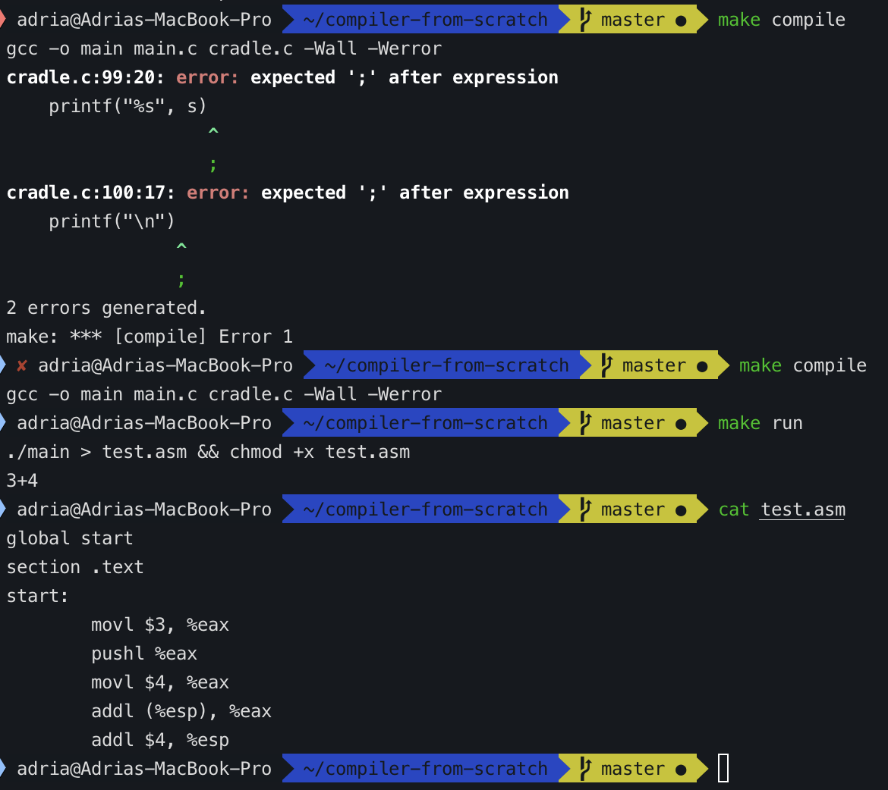

<h1 align="center"> 👷🏾‍♂️Implementing a toy compiler from scratch</h1>

[](http://commonmark.org) [](https://GitHub.com/adriacabeza/compiler-from-scratch/stargazers/)


This is just a toy to learn more about compilers, based on the [Let's Build a Compiler](https://compilers.iecc.com/crenshaw/tutor1.txt) by by Jack W. Crenshaw, who uses Pascal to compile code into 68000. This one takes C and compiles it to x86. Note that this is just a toy to learn, not planning to make it very efficent or difficult, just want to make it work. 

**------> NOT FINISHED THO <-------**




## Requirements
Just gcc and a text editor.

## This compiler is capable of
- Deal with variables
- Call functions (only works if they are just one letter... you know, for simplicity)
- Deal with numbers and basic arithmetic operations: add, sum, division, multiplication and unary minus
- Using the stack in order not to run out of registers. 

## Usage
Use the [Dockerfile](./Dockerfile) and the [Makefile](./Makefile)

## TODO
- Popping things from the stack
- Emit a 0 using xor instead of loading it 
- Deleting stupid stuff:
	- Adding or substracting  0 
	- Multiplying or dividing by 1


## Basic Backus-Naur Forms

```
<expression> ::= <term> [<addop> <term>]*
<term> ::= <factor> [<mulop> <factor>]*
<factor> ::= number | (expression) | variable
```


### Note about structure
<p align="center"></p>
Normally a compiler is separated by different parts:

- Front end of the compiler
	- Lexer: it makes the lexical analysis of compilation, this process is commonly known as tokenization. It converts the source file characters stream of our language into a list identifying the token type. 
	- Parser: it consists in different rules to parse a token stream produced by the lexer to produce intermediate code in the form of a list of abstract syntax trees. This part of the compiler has an understanding of the language's grammar. It is responsible for indentifying syntax errors. This step is very important for the different types of structures that are being created: assignment statments, code blocks, if statements, for loops, goto statements, procedure calls...

- Back end of the compiler
	- Encoder: The intermediate code that was generated using the parser has to be translated into some kind of assembly language. This is done by the encoder.  
	- Assembler: Finally the assembler relocates code into code containing absolute addresses. 

However, since this is a toy compiler, I'll just keep everything together just like Jack W. Crenshaw does for Turbo Pascal. 